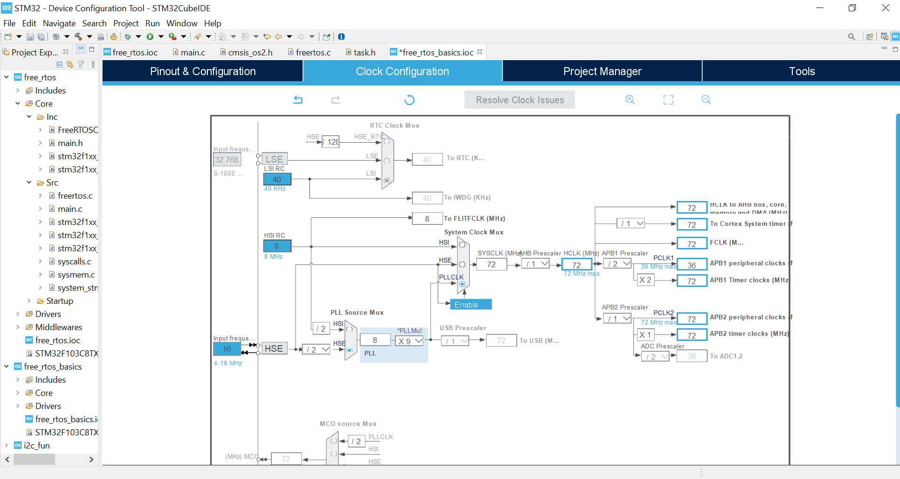
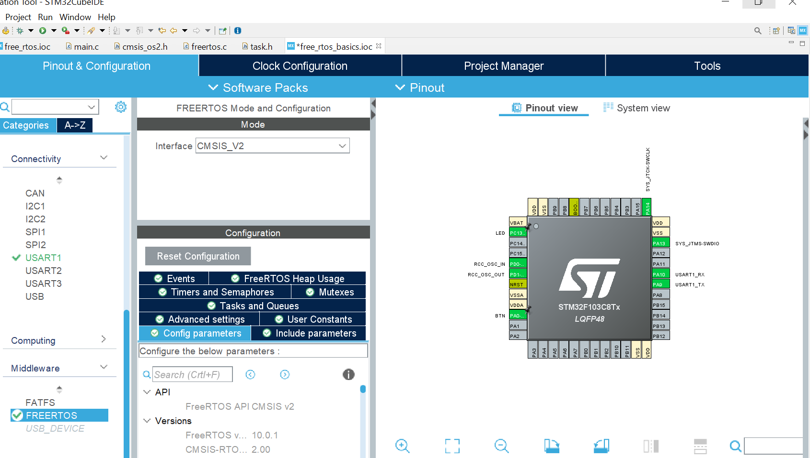
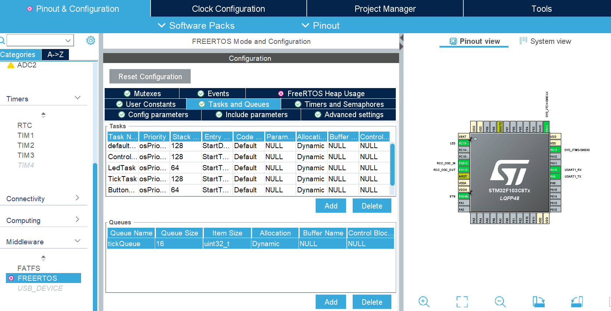

# STM32F103 Blue Pill FreeRTOS Demo

## Overview
This project demonstrates the use of FreeRTOS on the STM32F103C8 (“Blue Pill”) microcontroller.  
It includes tasks, queues, semaphores, mutexes, and ISR → task communication.

---

## Hardware Setup
- **MCU:** STM32F103C8 (Blue Pill)  
- **LED:** PC13 (onboard)  
- **Button:** PA0 (external, EXTI)  
- **UART:** USART1 (PA9 TX, PA10 RX)  

---

## RTOS Architecture

| Task Name       | Priority       | Role |
|-----------------|---------------|------|
| ControlTask     | Normal        | Periodically generates events & sends data to `tickQueue` |
| LedTask         | Low           | Waits for `ledSemaphore`, toggles LED (`ledMutex` protected) |
| TickTask        | Low           | Receives tick count from `tickQueue`, prints via UART (`printMutex`) |
| ButtonTask      | Above Normal  | Waits for button ISR semaphore, logs event, optionally triggers LED |
| StatsTask       | Low           | Prints task statistics and CPU usage every 10s |

---

## RTOS Objects

| Object           | Type          | Purpose |
|-----------------|---------------|---------|
| `tickQueue`      | Queue         | Transfer tick count between tasks |
| `ledSemaphore`   | Binary Semaphore | Event sync between `ControlTask` / ISR and `LedTask` |
| `ledMutex`       | Mutex         | Protect LED GPIO from concurrent access |
| `printMutex`     | Mutex         | Protect UART `printf` from concurrent access |

---

## CubeMX Configuration

1. **FreeRTOS CMSIS-V2**
   - Enable Mutexes, Semaphores, Timers, and Trace Facility
   - Use **Dynamic Allocation (heap_4.c)** for learning
2. **GPIO**
   - LED → Output (PC13)
   - Button → Input with EXTI (PA0)
3. **UART1**
   - TX: PA9, RX: PA10, 2 Mbps
   - Redirect `printf` to UART
4. **Timer**
   - TIM13 for runtime stats / optional periodic events

---

## Concept Summary

- **Queue** → Safe data transfer between tasks  
- **Semaphore** → Signal events (task ↔ task / ISR ↔ task)  
- **Mutex** → Protect shared resources like UART & GPIO  
- **ISR** → Hardware-triggered events (Button EXTI)  
- **Tasks** → Periodic or event-driven code execution  

---

## Notes
- Dynamic allocation is used for learning; **static allocation recommended for automotive / safety-critical systems**  
- This project is ideal for beginners to intermediate FreeRTOS learners  
- Supports STM32F103C8 (Blue Pill) board  

---

## 🛠️ STM32CubeMX Configuration Steps

This project was configured using **STM32CubeMX** with **FreeRTOS (CMSIS-RTOS v2)**.  
The following images explain the main configuration steps before code generation.

---

### 1️⃣ Clock Configuration (High Speed)

**Explanation:**  
This image shows the configuration of the system clock to run at a **high frequency**.  
The clock configuration is a critical step because FreeRTOS timing (SysTick, delays, task scheduling) depends directly on the system clock.  
A correct clock setup ensures accurate task delays, stable communication peripherals, and reliable real-time behavior.

---

### 2️⃣ FreeRTOS Version Selection (CMSIS-RTOS v2)

**Explanation:**  
This image shows where the **FreeRTOS version is selected in STM32CubeMX**.  
In this project, **CMSIS-RTOS v2** was chosen. STM32CubeMX also allows selecting **CMSIS-RTOS v1** if needed.

If FreeRTOS does not appear in CubeMX, it means the FreeRTOS package is not installed.  
In that case, you must install it from **Software Packs Manager** inside STM32CubeMX.

---

### 3️⃣ Task, Stack, and RTOS Objects Configuration

**Explanation:**  
This image shows the configuration of:
- FreeRTOS **tasks**
- **Stack size** for each task
- **Semaphores**
- **Mutexes**
- **Queues**

Each task is assigned its own priority and stack space according to the application needs.  
This configuration defines how tasks synchronize and communicate before generating the source code.

After completing all configurations, the code is generated by clicking:  
**Project → Generate Code** (top menu in STM32CubeMX).

---

